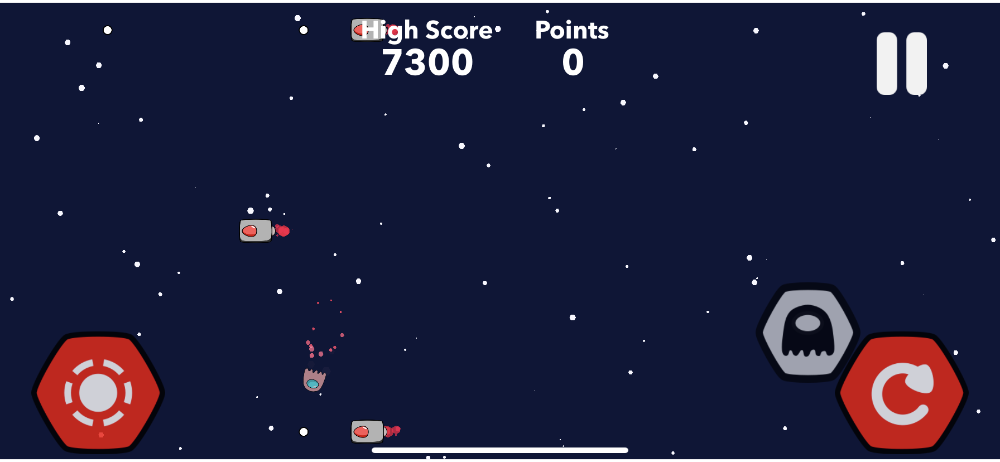

# Portfolio Introduction
Hi, I'm Dhruv Chowdhary, and this is my portfolio of projects that I have created throughout my programming journey. I started this journey by learning the basics of Java: Objects, Iteration, Arrays, and Inheritance. Using what I learned, I went on to create a [Tic Tac Toe Game](#Java). I also furthered my Java experience by taking "Introduction to Algorithms and Data Structures" at the University of Minnesota where I learned about more complex structures and some basics of Python. Then, I moved on to using Swift for iOS devices. I learned how to make a basic user interface with stacks and buttons in SwiftUI and also created some games with more depth in SpriteKit.

# Java 
[**Tic Tac Toe Game**](https://github.com/1201dc/Tic-Tac-Toe.git)

This is a Tic Tac Toe game that used 2D arrays and a JFrame with buttons to create a displayed clickable board. The game automatically switches between the "X" Player and the "O" player after each turn. 

# Swift (iOS) 
[**Space-Shooter**](https://github.com/1201dc/Space-Shooter)

This was my first game in Swift. I followed a tutorial to understand the basics of SpriteKit and added some of my own features to this project such as lives and a limited amount of ammo. This was a great first project to learn how to create games in Swift.

[**Ghost Pilots**](https://github.com/1201dc/Ghost-Pilots)

This is a shooting singeplayer game in progress. It required a lot of math, collisions, and particles to create smooth motion and animations. There are currently two different modes: "Turret Boss" and "Endless". I plan on adding multiplayer functionality to this game in the future. 

**Version 1.0:**

**Version 2.0:**

Main Menu

Endless Mode

Turret Boss Mode

**This app is currently in development!**

# Programming Experience
* Java (2019-)
* Swift (2020-)
* Python (2020-)
